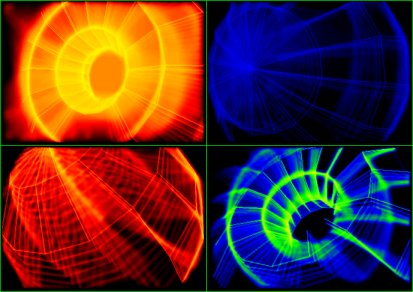



## A 3DvbBlurMotion \[Updated\. 5 times faster\]

### Description

BlurMotion its in *Pure VB*, but runs faster,faster on my K6-2 350Mhz, with 16 Mb Voodoo card, so

imagine on Pentium IV or Athlon 2000 Mhz with ATI or nVidia card! xD. See screenShot to believe me.

This source its a modification of 3DvbROT (see CodeId:43292). There is a flag to run the source

at fullscreen mode (320x240 at 16 bpp). Use the keys Z,X or Y to change speed rotation.

I included a short "howto" txt file if you want to make your own meshes.

Reports will be apreciated. Enjoy it!

*** UPDATED ***

Thanks for this optimizations to Carles P.V. Give him all medals! hehehe! :-)

-Adjusted min. and max values for X and Y

-Big blur motion scene (x:1-318, y:1-238)

-Calc3DRotations simplified

-Updated Proyect3D

-Removed border-Image

-New DrawLine (Bresenham) with checking points out of array "scene"

-Enable optimizations on Compiler options

Results: 5 times faster renderings
 
### More Info
 

             |
---                |---
**Submitted On**   |2004-02-01 14:56:18
**By**             |[John Ripper](https://github.com/Planet-Source-Code/PSCIndex/blob/master/ByAuthor/john-ripper.md)
**Level**          |Intermediate
**User Rating**    |4.8 (111 globes from 23 users)
**Compatibility**  |VB 5\.0, VB 6\.0
**Category**       |[Graphics](https://github.com/Planet-Source-Code/PSCIndex/blob/master/ByCategory/graphics__1-46.md)
**World**          |[Visual Basic](https://github.com/Planet-Source-Code/PSCIndex/blob/master/ByWorld/visual-basic.md)
**Archive File**   |[A\_3DvbBlur170329222004\.zip](https://github.com/Planet-Source-Code/john-ripper-a-3dvbblurmotion-updated-5-times-faster__1-51406/archive/master.zip)

